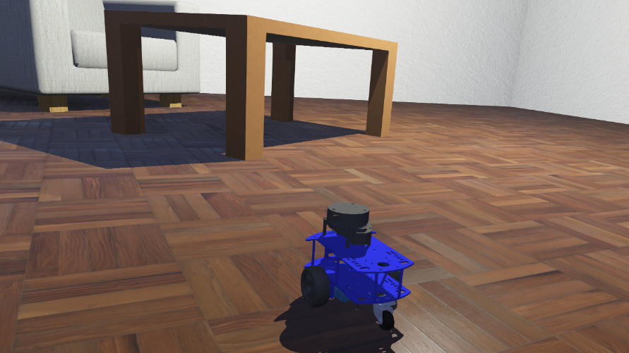

# :lady_beetle: Andino Webots Simulation

<!-- Image of andino in webots with shadows and stuff -->
<!-- Description and purpose -->


## :clipboard: Description

This package provides a simulation environment for Andino in Webots using [webots_ros2](https://github.com/cyberbotics/webots_ros2) to integrate it with ROS 2.

`Webots` uses [PROTO](https://cyberbotics.com/doc/reference/proto) as their robot description format, while the `Andino` robot description is written in `URDF` format.  
The [urdf2webots](https://github.com/cyberbotics/urdf2webots) package provides a tool to convert a `URDF` robot description to a `Webots`-compatible proto file. This tool is used by the `webots_ros2` package to convert the robot description in runtime.

## :inbox_tray: Installation 


This package makes use of some packages from https://github.com/Ekumen-OS/andino repository. Therefore, the repository is brought as a git submodule.
For so, when cloning this repository make sure to also init the submodules, this can be done adding a `--recursive` flag to the `git clone` command

1. Clone this repository

```sh
git clone git@github.com:ekumenlabs/andino_webots.git --recursive
```

2. Set up docker environment:
Refer to [docker readme](docker/README.md)

Once the container is running and dependencies have been installed you can proceed to package building.

## :package: Build

The package contains some dependencies that must be installed in order to build it:

```
rosdep install --from-paths src -i -y
```

Then build the package and source the install workspace. To do so run the following commands:

```sh
colcon build
source install/setup.bash
```

## :rocket: Usage

### Start empty simulation

Once the package is built and sourced, you can start an empty simulation by running the following ROS 2 launch file:


```sh
ros2 launch andino_webots launch_webots_world.launch.py world:=andino_webots
```

This launch file starts an empty simulation in a world given by the `world` argument. This argument defines the wbt file of the world where andino will run. It should be present in the package's `world` folder.   
Defaults to: `andino_webots`.
 

### Spawn andino in a webots_ros2 simulation

To spawn an Andino to a running webots_ros2 simulation you may run a separate launchfile:


```sh
ros2 launch andino_webots spawn_andino_webots.launch.py
```

This launch file supports the following launch arguments:

- `use_sim_time` . Parameter to indicate to the robot controller to synchronize with simulation time. Defaults to `true`.
- `rsp` . Parameter to decide whether to spawn the [`robot state publisher`](https://github.com/ros/robot_state_publisher) node or not. Defaults to `true`.

### Start an Andino Webots simulation

Alternatively you can launch the simulation along with the robot by running the `andino_webots.launch.py` launchfile, which includes both previous commands:

```sh
ros2 launch andino_webots andino_webots.launch.py
```

This launchfile accepts all previous arguments, with the addition of the choice to run a custom plugin to remove nodes from a robot in the simulation:

- `remove_nodes` . Decide whether to run the `NodeRemover` plugin, which removes specific nodes from a robot in the simulation. The parameters for this plugin can be set in the `node_remover_plugin.urdf` file in the package. Defaults to 'true'.

### :joystick: Teleoperate Andino in Webots

The robot is connected to the `webots_ros2_control` plugin, that enables teleoperation by requesting commands via `/cmd_vel`; so, out of the box, the package is ready to accept velocity commands.

### :camera: Sensors

The package automatically creates a ROS 2 interface for `Andino` sensors, exposing its readings to a topic at a given refresh rate. The parameters to configure this interface are defined in the [`andino_webots.urdf`](./andino_webots/urdf/andino_webots.urdf) description file.


## :wrench: Webots plugins
###  NodeRemover plugin 

The NodeRemover is a custom `webots_ros2` Supervisor plugin that allows users to modify the simulation in runtime by removing specific nodes from a given Robot.

The associated [launchfile](./andino_webots/launch/remove_nodes.launch.py) spawns a Supervisor robot in a running simulation and attaches the [node_remover_plugin](./node_remover_plugin/node_remover_plugin/node_remover_plugin.py) to it, which takes in a robot's name and list of the nodes to be removed as parameters.  
It's provided in this package as an example of the tool's capabilities, as well as a means of providing a workaround for `urdf2webots` not having a straightforward way to generate a free rotating joint, removing the caster's motor Nodes.

